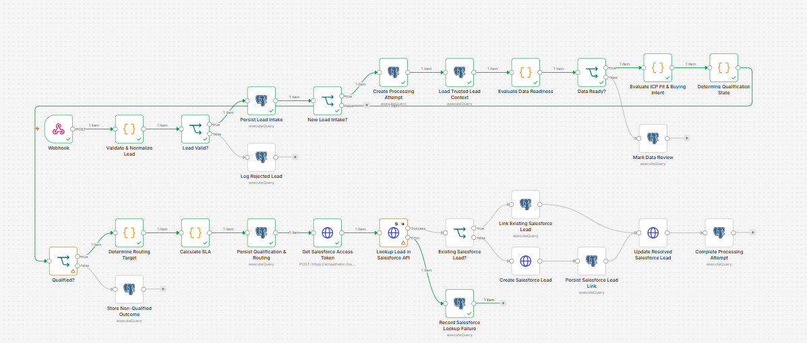
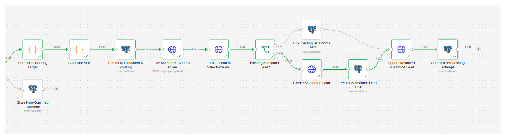
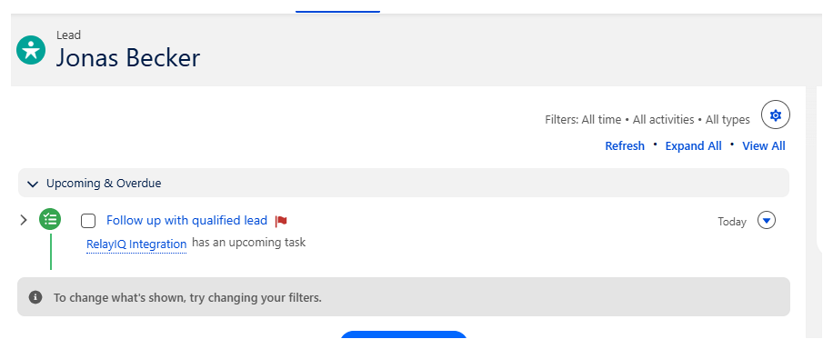
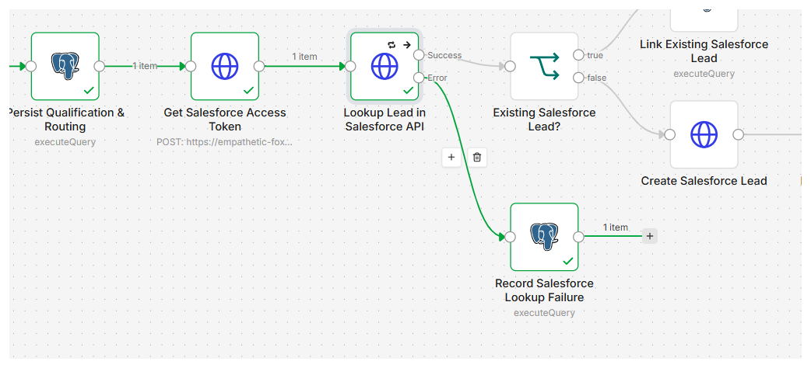

# P2 — End-to-End Lead-to-Opportunity Revenue Operations System

A Salesforce-centered Revenue Systems implementation that controls the lead lifecycle from inbound intake through validation, qualification, routing, SLA enforcement, CRM identity resolution, sales handoff, and operational failure handling.

[](LICENSE)
[](https://github.com/mahdi-eqbal/p2-lead-to-opportunity-revenue-system/actions/workflows/repository-quality.yml)


> This is an independently designed and implemented professional case study using synthetic B2B lead data. It is not presented as a client engagement, employer deployment, production implementation, or claimed commercial revenue result.

## Quick Review

- [System architecture](architecture/system-architecture.md)
- [Processing-state model](architecture/processing-state-model.md)
- [Salesforce data model](architecture/salesforce-data-model.md)
- [Source-of-truth matrix](architecture/source-of-truth-matrix.md)
- [Architecture decisions](adrs/)
- [Implementation documentation](docs/)
- [SQL assets](sql/)
- [Importable workflow](workflows/)
- [Formal test matrix](TEST-MATRIX.md)
- [Implementation evidence](evidence/n8n/)

## Business Problem

Revenue teams often receive inbound leads from multiple acquisition sources with inconsistent data, duplicate submissions, incomplete records, and different levels of buying intent. Sending every submission directly into Salesforce creates operational risk:

- duplicate CRM records;
- incomplete or unusable sales records;
- inconsistent qualification;
- unclear routing ownership;
- missed follow-up SLAs;
- unnecessary activity for non-qualified leads;
- integration failures with no durable processing history.

This system places a controlled operational layer between inbound lead capture and Salesforce. Only validated, qualified, and correctly routed leads enter the sales workflow, while every accepted, rejected, deferred, or failed event receives an explicit operational state.

## Architecture

| Layer | Responsibility |
|---|---|
| Lead source | Emits structured inbound lead events |
| n8n | Validates data, orchestrates processing, applies business rules, coordinates Salesforce APIs, and controls failure paths |
| PostgreSQL / Supabase | Persists intake events, processing attempts, qualification state, routing, SLA, CRM links, and failure metadata |
| Salesforce | Maintains lead lifecycle state and supports sales execution |
| Salesforce Flow | Creates the CRM-native follow-up task with SLA-derived timing |
| JavaScript | Implements normalization, data readiness, qualification, routing, and SLA calculations |

### End-to-End Processing Flow

```text
Inbound Lead Event
    ↓
Validation & Normalization
    ↓
Intake Persistence & Duplicate Detection
    ↓
Processing Attempt & Trusted Lead Context
    ↓
Data Readiness & Qualification
    ↓
Routing & SLA Calculation
    ↓
Salesforce Authentication & Identity Resolution
    ↓
Reuse Existing Lead or Create New Lead
    ↓
Salesforce Flow Task Creation
    ↓
Processing Completion or Explicit Failure State
```

### Implemented Workflow



## Core Control Layers

### Lead Intake and Validation

- receives inbound lead events through an n8n webhook;
- normalizes the incoming structure;
- checks the minimum required fields;
- routes invalid records to a dedicated rejection path;
- prevents rejected events from entering qualification or Salesforce processing.

### Event Identity and Idempotency

The system keeps event identity separate from lead identity:

- `intake_id` identifies an individual inbound event;
- `external_lead_id` identifies the business lead.

Repeated activity from the same lead can therefore be processed without treating every event as a duplicate, while the same `intake_id` cannot execute twice.

### Data Readiness and Qualification

Persisted lead context is evaluated before CRM handoff. The decision layer derives:

- data-readiness state;
- ICP fit;
- buying intent;
- qualification state;
- qualification reason.

Incomplete records are routed to Data Review. Non-qualified leads terminate through a controlled persistence path without creating unnecessary Salesforce activity.

### Routing and SLA

Qualified leads receive:

- a resolved routing target;
- an SLA start time;
- an SLA due time;
- an explicit SLA status.

These states are persisted before CRM handoff so Salesforce receives an already-resolved business decision.

### Salesforce Identity Resolution

Before creating a Salesforce Lead, the workflow searches by external lead identity:

- an existing Lead is reused and linked to the current processing attempt;
- a missing Lead is created and its Salesforce ID is persisted;
- the resolved Lead is updated with qualification, routing, and SLA context.

This prevents blind CRM record creation for every intake event.

### CRM-Native Sales Handoff

After a qualified Lead reaches Salesforce, a record-triggered Salesforce Flow creates the follow-up task:

```text
Follow up with qualified lead
```

The task is assigned to the Lead owner and receives an SLA-derived due date.

### Failure Handling

- Salesforce lookup requests use retry behavior;
- Salesforce API errors follow a dedicated error output;
- failures are persisted with status, type, reason, and completion time;
- failed integrations cannot be mistaken for successful or unprocessed records.

## Validated Scenarios

| Scenario | Validated behavior |
|---|---|
| Qualified new lead | Full processing and Salesforce handoff |
| Invalid lead | Rejected and logged |
| Incomplete lead | Routed to Data Review |
| Non-qualified lead | Outcome persisted without Salesforce handoff |
| Duplicate intake | Reprocessing prevented |
| Existing Salesforce Lead | Existing CRM record reused |
| New Salesforce Lead | New CRM record created and linked |
| Salesforce API failure | Failure isolated and persisted |
| Sales follow-up | Salesforce Task created |
| SLA enforcement | Follow-up Task receives calculated due date |

See the [formal test matrix](TEST-MATRIX.md) for the complete validation scope.

## Evidence Highlights

### Qualified Happy Path



### Salesforce Task with SLA Due Date



### Controlled Salesforce API Failure



Additional positive, negative, duplicate, review, identity, and failure evidence is available under [`evidence/n8n/`](evidence/n8n/).

## Key Design Decisions

### PostgreSQL Is the Operational Control Layer

Salesforce is the CRM and sales-execution system, but it is not the only source of processing state. PostgreSQL preserves intake, qualification, routing, SLA, failure, and completion history independently from CRM availability.

### Qualification Happens Before CRM Handoff

Invalid, incomplete, and non-qualified records are stopped before unnecessary sales activity is created.

### Identity Resolution Precedes Record Creation

Salesforce is queried before creating a Lead, reducing duplicate CRM records and supporting repeated activity for an existing lead.

### Failures Become Explicit Business States

An integration failure is not treated as an invisible workflow crash. It becomes inspectable operational data with a controlled recovery path.

## Repository Structure

```text
p2-lead-to-opportunity-revenue-system/
├── adrs/          # Architecture decision records
├── architecture/  # System, processing-state, Salesforce data-model, and ownership documentation
├── docs/          # Implementation and operational documentation
├── evidence/
│   └── n8n/       # Executed positive, negative, duplicate, SLA, identity, and failure evidence
├── sql/           # PostgreSQL schema and operational queries
├── workflows/     # Redacted n8n workflow export
├── .gitignore
├── README.md
└── TEST-MATRIX.md
```

## How to Review the Implementation

1. Start with the [system architecture](architecture/system-architecture.md).
2. Review the [processing-state model](architecture/processing-state-model.md) and [source-of-truth matrix](architecture/source-of-truth-matrix.md).
3. Inspect the Salesforce object and field design in the [Salesforce data model](architecture/salesforce-data-model.md).
4. Review database assets under [`sql/`](sql/) and the workflow export under [`workflows/`](workflows/).
5. Compare the implemented behavior against [`TEST-MATRIX.md`](TEST-MATRIX.md).
6. Inspect the executed system outcomes under [`evidence/n8n/`](evidence/n8n/).

## Security

Sensitive integration information is intentionally excluded from the public repository. Published assets must not contain:

- Salesforce access or refresh tokens;
- Salesforce credentials;
- database passwords or connection strings;
- webhook authentication secrets;
- API secrets;
- production or customer data.

The public workflow export is intended to preserve architecture and business logic without distributing active credentials.

## What This Project Demonstrates

- Revenue Systems and RevOps architecture;
- Salesforce REST API integration and identity resolution;
- Salesforce Flow and CRM-native sales execution;
- n8n orchestration and JavaScript business logic;
- PostgreSQL operational modeling;
- lead validation, qualification, routing, and SLA management;
- event-level idempotency and CRM duplicate prevention;
- explicit data-quality, negative-path, retry, and failure controls;
- evidence-based implementation validation.

---

Built by [Mahdi Eqbal](https://github.com/mahdi-eqbal) as an independent Revenue Systems / GTM Engineering implementation case study.


